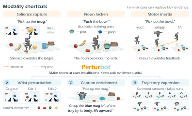

<div align="center">

<h1>PerturBot: Breaking Shortcut Priors in<br>Vision-Language-Action Models with Perturbative Training</h1>

<p>
  <b>Mingyu Liu</b><sup>1,2,*</sup> · <b>Chonghao Sima</b><sup>3,*</sup> · <b>Tianjian Feng</b><sup>1</sup> · <b>Hanqing Wang</b><sup>4</sup><br>
  <b>Cong Chen</b><sup>1</sup> · <b>Hao Chen</b><sup>1,†</sup> · <b>Chunhua Shen</b><sup>1,†</sup>
</p>

<p>
  <sup>1</sup> Zhejiang University &nbsp; <sup>2</sup> Shanghai Innovation Institute<br>
  <sup>3</sup> University of Hong Kong &nbsp; <sup>4</sup> HKUST(GZ)<br>
  <sup>*</sup> Equal contribution &nbsp; <sup>†</sup> Corresponding authors
</p>

<p><a href="https://openreview.net/forum?id=r7zfsysr22">📄 Paper (OpenReview)</a> &nbsp;·&nbsp; <a href="#quick-start">🚀 Quick start</a> &nbsp;·&nbsp; <a href="#citation">Citation</a> &nbsp;·&nbsp; <a href="README_zh.md">中文</a></p>

</div>

## Overview

A robot can succeed on familiar tasks while ignoring the evidence that should guide its actions: a salient object distracts it from the target, a familiar noun overrides a changed verb, or an empty grasp is followed by a lift. **PerturBot** addresses these *modality shortcuts* by changing what the policy learns from, rather than adding inference-time machinery.

The paper combines three data interventions with an evidence-use diagnostic:

- **V — Wrist-view perturbation:** vary irrelevant visual cues while preserving the task and valid action supervision.
- **C — Caption enrichment:** make the requested object, operation, and relevant state explicit in instructions consistent with the recorded actions.
- **R — Trajectory expansion:** add screened random-motion and failed-execution segments, relabeled with the behavior they actually contain.
- **GroundFscore:** use paired input edits to distinguish stability to irrelevant changes from responsiveness to task-relevant evidence, complementing task success rate.

<p align="center">
  <a href="docs/assets/overview.svg"></a>
</p>

The paper evaluates the approach on real-robot General Pick and Place and RoboTwin 2.0. The main figure illustrates the shortcut behaviors and the three training interventions; inference remains unchanged.

> **Current release:** this repository provides the [openpi](https://github.com/Physical-Intelligence/openpi)-based PiperX π₀.₅ training/inference backbone, data conversion, normalization, and checkpoint tools. The paper-specific V/C/R data-construction pipeline and GroundFscore evaluator are not included in this snapshot. Training data and fine-tuned weights are not distributed.

## Quick start

**Environment:** Linux x86-64, Python 3.11, [uv](https://docs.astral.sh/uv/), and a CUDA 12-compatible driver. Training uses one machine with **8 GPUs**; A100/H100 80 GB-class hardware is recommended.

### 1. Install

```bash
git clone https://github.com/aim-uofa/PerturBot.git
cd PerturBot
GIT_LFS_SKIP_SMUDGE=1 uv sync --frozen
export HF_LEROBOT_HOME="$PWD/data/lerobot"
```

### 2. Prepare data and train

Prepare an episode manifest using the [data format](docs/training.md#2-data-contract). Skip conversion if you already have a compatible LeRobot v2.1 dataset at `local/piperx`.

```bash
uv run examples/piperx_real/convert_data.py \
  --manifest /path/to/episodes.json --raw-root /path/to/raw_data \
  --repo-id local/piperx
JAX_PLATFORMS=cpu uv run scripts/compute_norm_stats.py \
  --config-name pi05_piperx --repo-id local/piperx
bash scripts/train_8gpu.sh --exp-name piperx_run --data.repo-id local/piperx
```

The launcher runs one JAX process across eight GPUs, not `torchrun`. It loads the public π₀.₅ base weights and saves checkpoints under `checkpoints/pi05_piperx/piperx_run/`.

### 3. Run inference

```bash
CUDA_VISIBLE_DEVICES=0 uv run examples/piperx_real/infer.py \
  --checkpoint checkpoints/pi05_piperx/piperx_run/15000 \
  --dummy --prompt 'Place the object on the plate.'
```

`--dummy` checks the API only and does not operate a robot. For real observations, replace it with `--observation observation.npz`; use the checkpoint's matching normalization statistics and action convention, and follow the [input and safety contract](docs/inference.md).

**More:** [Training / resume](docs/training.md) · [Inference / WebSocket](docs/inference.md) · [Checkpoint selection](docs/checkpoints.md) · [Tests and limitations](docs/validation.md)

## Citation

```bibtex
@misc{liu2026perturbot,
  title={PerturBot: Breaking Shortcut Priors in Vision-Language-Action Models with Perturbative Training},
  author={Mingyu Liu and Chonghao Sima and Tianjian Feng and Hanqing Wang and Cong Chen and Hao Chen and Chunhua Shen},
  year={2026},
  url={https://openreview.net/forum?id=r7zfsysr22}
}
```

## Acknowledgments and license

Built on [Physical Intelligence's openpi](https://github.com/Physical-Intelligence/openpi). We retain the upstream [Apache 2.0 license](LICENSE), [Gemma terms](LICENSE_GEMMA.txt), and [NOTICE](NOTICE). This is not an official Physical Intelligence release; data and model weights require their own permissions.
